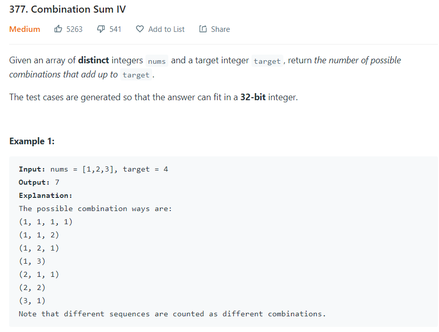
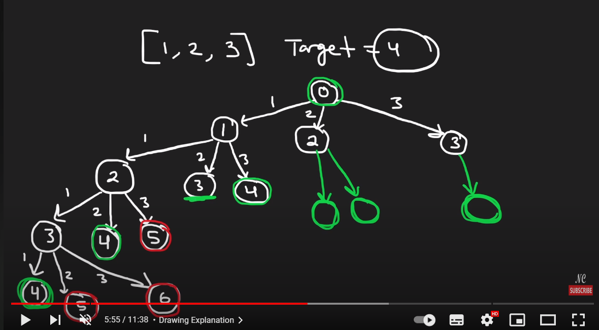
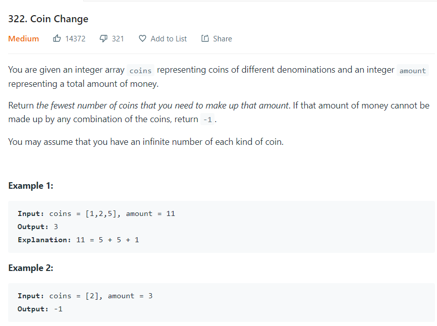
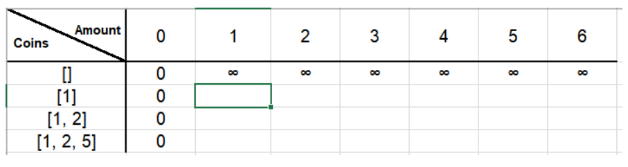
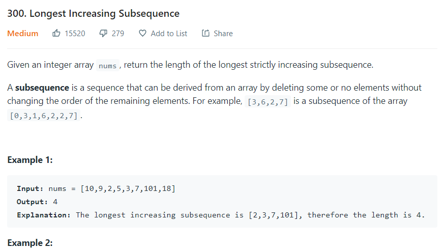

Who am I?
 - I am Varun, you could address me Varun Skywalker. I am a CS student at Arizona State University

What is this?
 - This is my personal learning updates and any interesting works I contributed to.

Who will it help?
 - I would be happy if anyone gets motivated or learns something from this

 How would this help me?
 - This is my way to bully myself to be consistent. 

Oct 27

[Dynamic_Programming]

We could use dynamic programming to solve this as this needs recursion and also there are sub problems which are repeated. 
For example nums = [1,2,3] and target = 4 and we have to calculate the number of ways we can get target 4 using the numbers in nums array and we can also reuse numbers. We can start with any number 1,2 or 3 as all of them are smaller than 4 and for example we started with 1 and rest of the sum = 3 (4-1) and now we recursively approach how many ways we can get target 3 and suppose we again started with 1 and in recursion we calculate the subproblem of ways we can get target sum 2.
Now for target 4, if we start with 2 instead of 1, we have to solve for the subproblem target =2 which we have already calculated in while starting the recursion with 1. 

So we need to memoize and this becomes a DP problem

We maintain a single array DP and if our target becomes zero then we have reached a solution if traveled via that recursion tree. So our base case is dp[0] = 1, and now for calculating target we have to calculate the how many way to get the combination sum for 1 to target-1. This is because basically our answer is sum(target - nums[0] , target - nums[2], ..., target - nums[n-1]) where n = len(nums). If still unclear, jus think in this way if target-nums[0] can be acheieved in x ways then then same number of ways we can also acheive target as we can simply add nums[0] to the target-nums[0] solution.

Finally we have two for loops, one running from 1 to target and other running for all the numbers in the nums array.
Check out for code [link](dynamic_programming/combination_sum_4.py)

Oct 28

[Dynamic_Programming]

We will use dynamic programming to solve this problem
DP formulation ->  We will maintain a 2D array, rows could be the coins and columns would be the from 0 to amount. See the below picture for better understanding.

Everytime we have two choices either to include that coin or leave that coin. So if we take that coin then we update dp[i][j] to be 1 + dp[i][j - present_coin_value], If we leave the coin then we update our dp[i][j] as dp[i-1][j] that is the minimum number of coins to get the amount if we dont have this coin.
Check out for code [link](dynamic_programming/coin_change.py)

Oct 29

I wasted this day, went to a shopping and pub. Happy Halloween :)

Oct 30

[Dynamic_Programming]

DP again. This can be done in 2 ways. We can sort the array and find the longest common subsequence between them or we can do using a 1D array where we will store the max longest subsequence uptil that point which I think is more intuitive.
DP formulation ->  We will maintain a 1D array, dp[i] indicates that longest increasing subsequence up to that index. So dp[1] would be 1 and for calculating dp[k] we will iterate the array from k-1 index to 0th index and for all the indexes which have value less than arr[k], we get the maximum of all those values in the dp array and that max values plus one would be our dp[k]
dp[k] = max(dp[i...j]) where arr[i...j] < arr[k] and i..j < k

Check out for code [link](dynamic_programming/coin_change.py)

 
